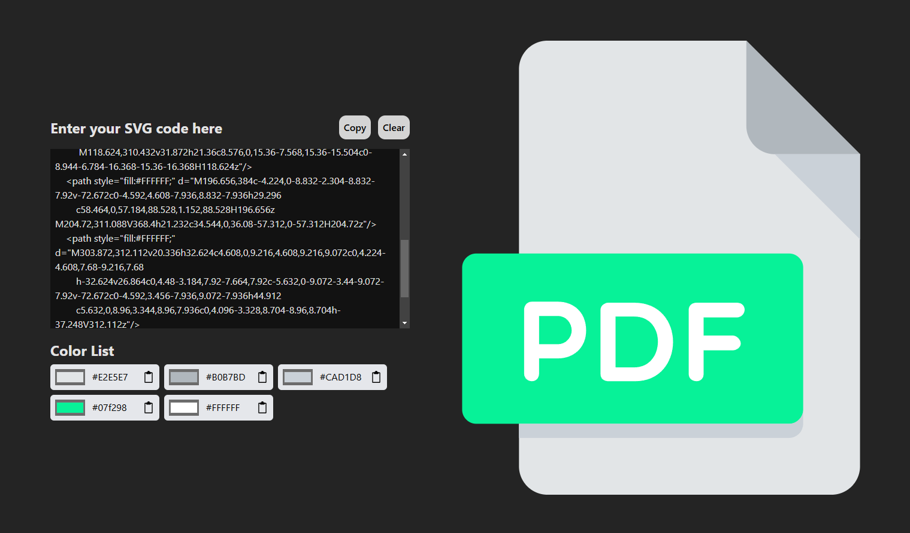

# SVG Painter

Compact web tool to recolor (paint) SVGs quickly.

## How to use

1. Go to the website (https://svg-painter.vercel.app/)
2. Paste your SVG code into the input
3. Change the colors to your liking
4. Copy the finished SVG code and use it!

## Limitations

- Not responsive (for now)
- Only supports SVGs with hexadecimal color codes
- It uses the native HTML color picker so implementation varies widely

## License

MIT